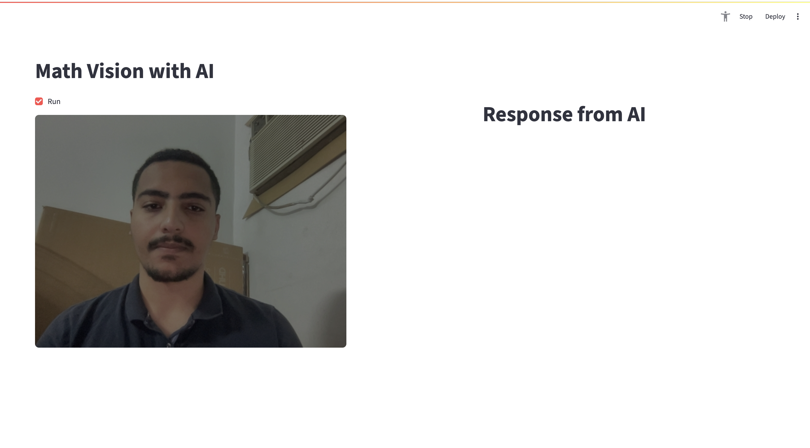
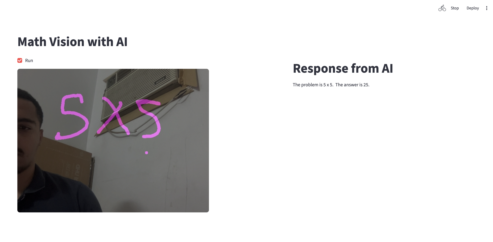
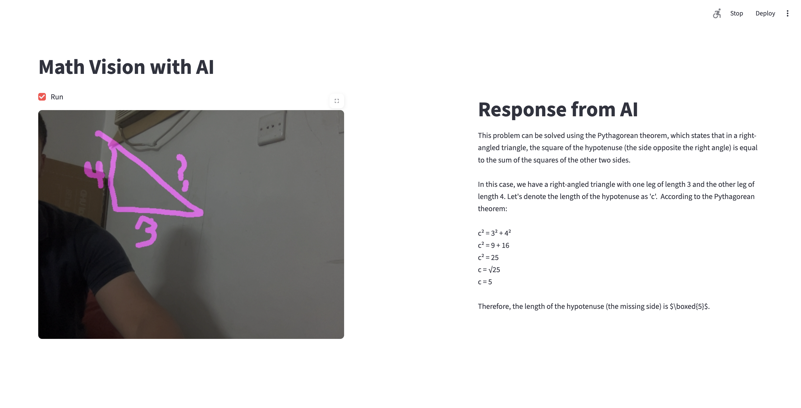

# Math Vision with AI

This project is an interactive computer vision application that combines hand gesture recognition, drawing, and AI-powered mathematical problem solving. Built with Python, OpenCV, Streamlit, and Google Gemini, it allows users to draw math problems using hand gestures and receive AI-generated solutions.

## Features

- **Hand Gesture Drawing:** Use your hand to draw on a virtual canvas via webcam.
- **Gesture Controls:**
    - Draw with your index finger.
    - Clear the canvas with your thumb.
    - Send your drawing to AI for solving with a specific gesture.
- **AI Integration:** Uses Google Gemini to interpret and solve drawn mathematical problems.
- **Real-Time Feedback:** View your drawing and AI responses instantly in the Streamlit interface.

## Installation

1. **Clone the repository:**
        ```bash
        git clone https://github.com/AbdullahAbdelaziz122/opencv-python-projects.git
        cd opencv-python-projects/17-mathmatics-vision
        ```
2. **Install dependencies:**
        ```bash
        pip install -r requirements.txt
        ```
        Main dependencies:
        - Python 3.x
        - OpenCV (`opencv-python`)
        - NumPy
        - Streamlit
        - Pillow
        - python-dotenv
        - google-generativeai
        - Custom `handTrackingModule`

3. **Set up Google API Key:**
        - Create a `.env` file in the project directory.
        - Add your Google API key:
            ```
            GOOGLE_API_KEY=your_api_key_here
            ```

## Usage

1. **Start the Streamlit app:**
        ```bash
        streamlit run src/main.py
        ```
2. **Interact with the app:**
        - Enable your webcam.
        - Use hand gestures to draw and control the canvas.
        - Send your drawing to AI for mathematical interpretation.

## Usage Instructions

- **Drawing:** Raise your index finger while keeping all other fingers down to draw on the canvas.
- **Clear Canvas:** Perform the "like" gesture (thumb up) to clear the screen.
- **Send to AI:** Hold your thumb down and raise the other fingers to submit your mathematical formula to the AI for solving.

## Directory Structure

```
17-mathmatics-vision/
├── README.md
├── requirements.txt
├── .env
├── images/
│   └── sample.jpg
├── src/
│   ├── main.py
│   └── handTrackingModule.py
└── ...
```

## Example Workflow

1. Draw a mathematical problem using your index finger.
2. Clear the canvas with your thumb.
3. Show the "send" gesture (index + other fingers up) to submit your drawing to AI.
4. View the AI's solution in the app.

## Contributing

Contributions are welcome! Please open issues or submit pull requests for improvements or new features.


## References

- [OpenCV Documentation](https://docs.opencv.org/)
- [Streamlit Documentation](https://docs.streamlit.io/)
- [Google Generative AI](https://ai.google.dev/)
- [NumPy Documentation](https://numpy.org/doc/)

### Demo Pictures



[Demo pictures]
